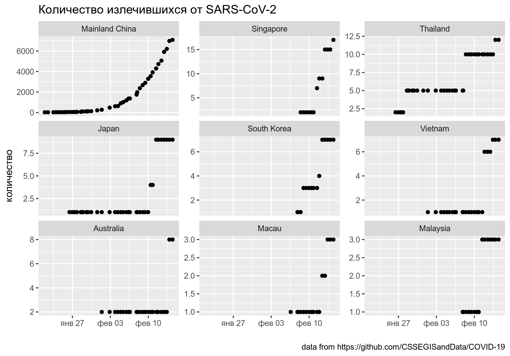
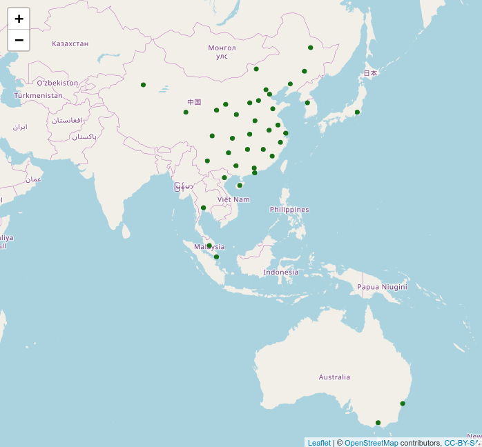
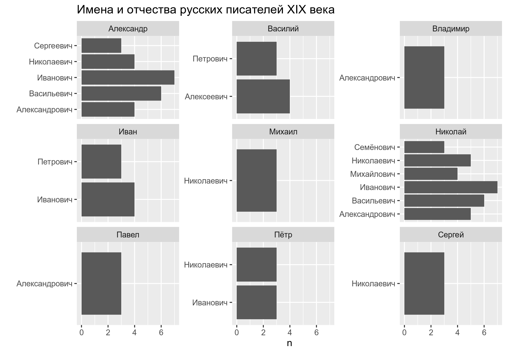

# Анализ данных для DH, hw4: lubridate, leaflet, rvest

* дедлайн для задания: **18.03.2020, 23:59**
* все задания нужно сделать в файле `hw_4.Rmd`, а потом, написав свое имя в соответствующем поле файла `.Rmd`, скомпилировать `.html` и загрузить на Github Pages созданного репозитория
* задания не предполагают использование каких-то других пакетов или датасетов, кроме тех, что указаны в соответсвтующем файле `hw_4.Rmd`
* не стесняйтесь задавать вопросы (но лучше открывать issue, а не писать в телеграме). Помните, что я не смогу помочь, если все начнут писать в последний вечер перед дедлайном, так что начните делать задания заранее.

## Задание 4.1

В [репозитории](https://github.com/CSSEGISandData/COVID-19) университета Джона Хопкинса помимо всего прочего хранится датасет, посвященным количеству излечившихся от короновируса SARS-CoV-2 (я скопировал файл в папку `data` данного репозитория, файл `ncov-recovered.csv`). Трансформируйте данные, отфильтруйте страны, в которых количество излечившихся больше 2, и постройте график, представленный ниже, упорядочив фасеты на основании максимального значения. Проследите, чтобы по оси x была именно дата.

## Задание 4.2

Используйте датасет из предыдущего задания, чтобы обозначить расположение мест на карте, где количество излечившихся больше 2.

## Задание 4.3

Обкачайте раздел википедии [русские писатели XIX века](https://ru.wikipedia.org/w/index.php?title=%D0%9A%D0%B0%D1%82%D0%B5%D0%B3%D0%BE%D1%80%D0%B8%D1%8F:%D0%A0%D1%83%D1%81%D1%81%D0%BA%D0%B8%D0%B5_%D0%BF%D0%B8%D1%81%D0%B0%D1%82%D0%B5%D0%BB%D0%B8_XIX_%D0%B2%D0%B5%D0%BA%D0%B0) (будьте внимательны --- там несколько страниц), посчитайте количество уникальных комбинаций имени и отчества среди писателей, отфильтруйте те, которые встречаются чаще двух раз и визуализируйте как на графике ниже.

