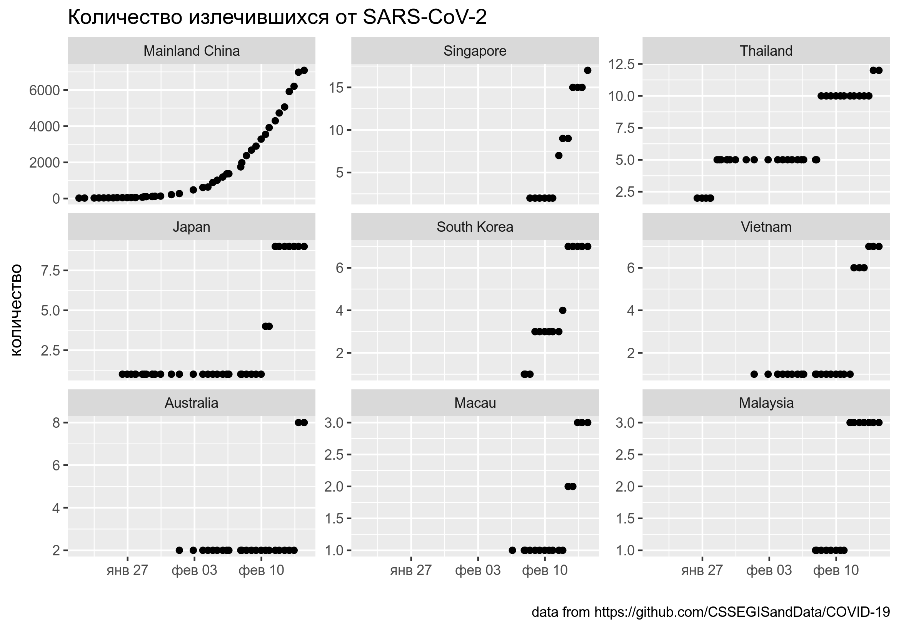
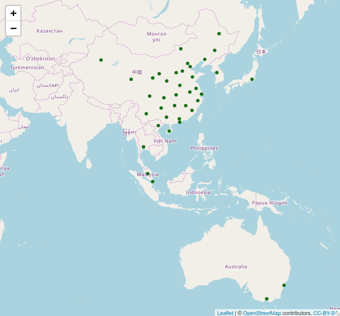
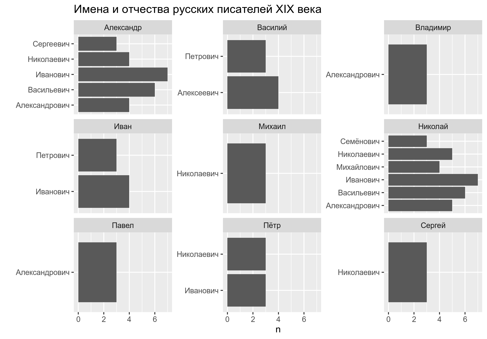

```{r, message=FALSE}
library(tidyverse)
library(rvest)
library(leaflet)
library(lubridate)
```

## Задание 4.1

В [репозитории](https://github.com/CSSEGISandData/COVID-19) университета Джона Хопкинса помимо всего прочего хранится датасет, посвященным количеству излечившихся от короновируса SARS-CoV-2 (папка `data`, файл `ncov-recovered.csv`). Трансформируйте данные, отфильтруйте страны, в которых количество излечившихся больше 2, и постройте график, представленный ниже, упорядочив фасеты на основании максимального значения. Проследите, чтобы по оси x была именно дата.



```{r}

```


## Задание 4.2

Используйте датасет из предыдущего задания, чтобы обозначить расположение мест на карте, где количество излечившихся больше 2.



```{r}

```


## Задание 4.3

Обкачайте раздел википедии [русские писатели XIX века](https://ru.wikipedia.org/w/index.php?title=%D0%9A%D0%B0%D1%82%D0%B5%D0%B3%D0%BE%D1%80%D0%B8%D1%8F:%D0%A0%D1%83%D1%81%D1%81%D0%BA%D0%B8%D0%B5_%D0%BF%D0%B8%D1%81%D0%B0%D1%82%D0%B5%D0%BB%D0%B8_XIX_%D0%B2%D0%B5%D0%BA%D0%B0) (будьте внимательны --- там несколько страниц), посчитайте количество уникальных комбинаций имени и отчества среди писателей, отфильтруйте те, которые встречаются чаще двух раз и визуализируйте как на графике ниже.



```{r}

```

